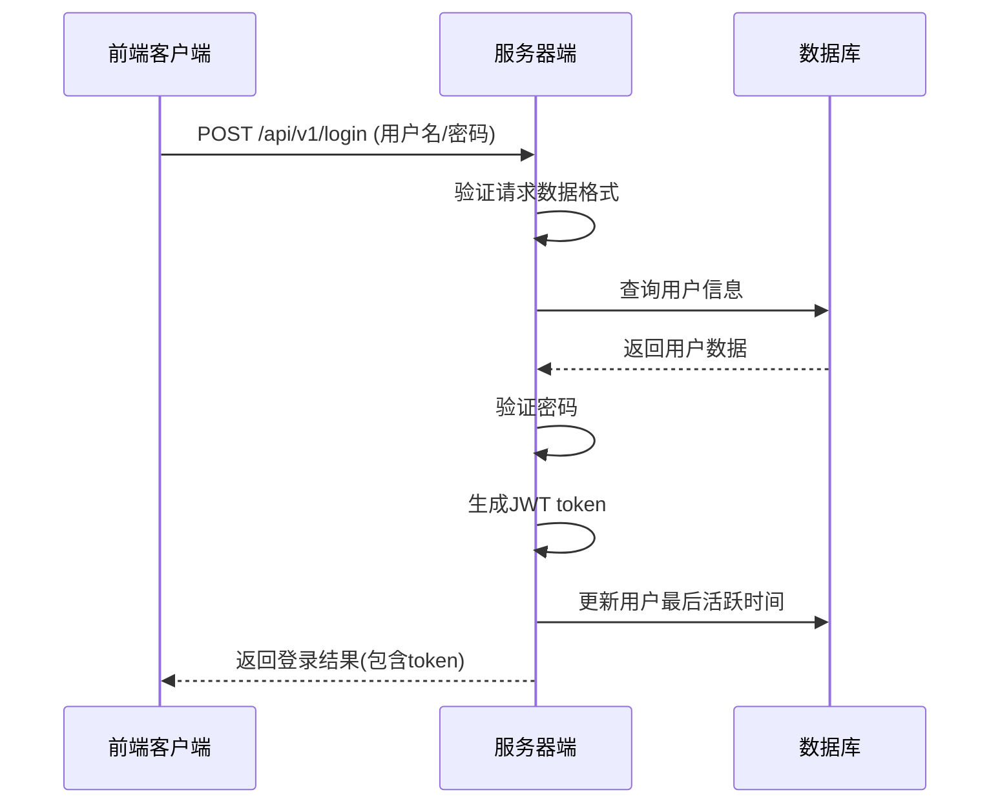

# 用户登录功能设计文档

## 1. 功能概述
用户登录功能允许已注册用户使用其用户名/邮箱和密码进行身份验证，并返回一个JWT token用于后续请求的身份验证。

## 2. 设计流程

### 2.1 整体流程


### 2.2 详细处理流程
1. **请求接收与验证**
   - 服务器接收客户端发送的POST请求
   - 验证请求数据格式是否符合要求
   - 检查用户名/邮箱和密码是否存在且格式正确

2. **用户身份验证**
   - 根据用户名/邮箱查询数据库
   - 如果用户名不存在，尝试通过邮箱查找
   - 比较输入密码与数据库中存储的密码

3. **Token生成与响应**
   - 生成符合JWT规则的token
   - 更新用户最后活跃时间
   - 返回登录成功响应，包含用户信息和token

## 3. 输入接口

### 3.1 API端点
- **URL**: `/api/v1/login`
- **方法**: `POST`
- **Content-Type**: `application/json`

### 3.2 请求参数
| 参数名 | 类型 | 必需 | 描述 | 验证规则 |
|-------|------|------|------|---------|
| username | string | 是 | 用户名或邮箱 | 非空，长度1-50字符 |
| password | string | 是 | 用户密码 | 非空，长度6-20字符 |

### 3.3 请求示例
```json
{
  "username": "testuser",
  "password": "Test12345"
}
```

### 3.4 输入验证
登录请求经过以下验证切面:
1. **check_login_input**: 验证请求数据格式是否正确

## 4. 输出接口

### 4.1 响应状态码
| 状态码 | 描述 |
|-------|------|
| 200 OK | 登录成功 |
| 400 Bad Request | 请求参数错误或登录失败 |
| 500 Internal Server Error | 服务器内部错误 |

### 4.2 响应格式
```json
{
  "success": true,        // 登录是否成功
  "message": "登录成功",   // 响应消息
  "errors": null,         // 错误信息(失败时非空)
  "data": {               // 登录成功时返回的用户信息
    "id": 1,              // 用户ID
    "username": "testuser", // 用户名
    "email": "test@example.com", // 邮箱
    "token": "base64_encoded_token" // JWT token
  },
  "timestamp": "",       // 时间戳
  "code": 200             // 响应状态码
}
```

### 4.3 响应示例

#### 登录成功
```json
{
  "success": true,
  "message": "登录成功",
  "errors": null,
  "data": {
    "id": 1,
    "username": "testuser",
    "email": "test@example.com",
    "token": "MTp0ZXN0dXNlcjp0ZXN0QGV4YW1wbGUuY29tOjE3MDIxNDU4MzQxOTg="
  },
  "timestamp": "",
  "code": 200
}
```

#### 登录失败
```json
{
  "success": false,
  "message": "用户名或密码错误",
  "errors": null,
  "data": null,
  "timestamp": "",
  "code": 400
}
```

## 5. 数据结构

### 5.1 登录请求结构体
```cpp
struct login_info {
  std::string username; // 用户名或邮箱
  std::string password; // 密码
};
```

### 5.2 登录响应数据结构体
```cpp
struct login_resp_data {
  uint64_t id;           // 用户ID
  std::string username;  // 用户名
  std::string email;     // 邮箱
  std::string token;     // JWT token
};
```

### 5.3 用户数据库表结构
```sql
CREATE TABLE users (
  id BIGINT PRIMARY KEY AUTO_INCREMENT,
  user_name VARCHAR(50) UNIQUE NOT NULL,
  email VARCHAR(100) UNIQUE NOT NULL,
  pwd_hash VARCHAR(100) NOT NULL,
  is_verifyed INT DEFAULT 0,
  register_ip VARCHAR(20),
  created_at BIGINT,
  updated_at BIGINT,
  last_active_at BIGINT
);
```

## 6. 错误处理

### 6.1 错误类型
| 错误场景 | 错误消息 | 状态码 |
|---------|---------|-------|
| 用户名/邮箱不存在 | 用户名或密码错误 | 400 |
| 密码错误 | 用户名或密码错误 | 400 |
| 请求数据格式错误 | 请求数据格式错误 | 400 |
| 服务器内部错误 | 服务器内部错误 | 500 |

### 6.2 错误处理机制
- 所有错误都会返回标准的错误响应格式
- 对于敏感错误信息（如"用户名不存在"），统一返回"用户名或密码错误"以提高安全性

## 7. 安全考虑

### 7.1 密码安全
- 当前实现中密码以明文存储（仅用于演示）
- 生产环境中应使用哈希算法（如bcrypt）存储密码

### 7.2 Token安全
- 当前实现使用简单的base64编码生成token
- 生产环境中应使用更安全的算法（如HMAC-SHA256）
- 建议添加token过期时间

### 7.3 输入验证
- 所有输入都经过严格的格式验证
- 防止SQL注入和XSS攻击

## 8. 代码实现

### 8.1 核心实现文件
- **user_login.hpp**: 登录功能的核心实现
- **jwt_token.hpp**: JWT token生成和验证的实现
- **feather.cpp**: 登录路由配置
- **user_aspects.hpp**: 输入验证切面
- **entity.hpp**: 数据结构定义

### 8.2 核心代码片段

#### 登录处理函数
```cpp
void handle_login(coro_http_request &req, coro_http_response &resp) {
  login_info info = std::any_cast<login_info>(req.get_user_data());

  // 查询数据库
  auto &db_pool = connection_pool<dbng<mysql>>::instance();
  auto conn = db_pool.get();
  
  users_t user{};
  
  // 先尝试通过用户名查找
  user.user_name = info.username;
  auto r = conn->get_one(user, "user_name");
  
  // 如果用户名不存在，尝试通过邮箱查找
  if (!r) {
    user.email = info.username;
    r = conn->get_one(user, "email");
    
    if (!r) {
      // 用户不存在
      rest_response<std::string_view> data{false, "用户名或密码错误"};
      std::string json;
      iguana::to_json(data, json);
      resp.set_status_and_content(status_type::bad_request, std::move(json));
      return;
    }
  }
  
  // 验证密码
  if (user.pwd_hash != info.password) {
    rest_response<std::string_view> data{false, "用户名或密码错误"};
    std::string json;
    iguana::to_json(data, json);
    resp.set_status_and_content(status_type::bad_request, std::move(json));
    return;
  }
  
  // 生成JWT token
  std::string token = generate_jwt_token(user.id, user.user_name, user.email);
  
  // 更新最后活跃时间
  user.last_active_at = get_jwt_timestamp_milliseconds();
  conn->update_one(user, "last_active_at");
  
  // 返回登录成功响应
  login_resp_data login_data{user.id, user.user_name, user.email, token};
  rest_response<login_resp_data> data{};
  data.success = true;
  data.message = "登录成功";
  data.data = login_data;
  
  std::string json;
  iguana::to_json(data, json);
  
  resp.set_status_and_content(status_type::ok, std::move(json));
}
```

#### Token生成函数
```cpp
// 生成JWT token的函数
auto generate_jwt_token(uint64_t user_id, const std::string &username, const std::string &email) {
    // 简单的JWT生成，实际应用中应该使用更安全的实现
    // 这里使用base64编码的方式生成一个简单的token
    // 格式: user_id:username:email:timestamp
    
    std::string token = std::to_string(user_id) + ":" + username + ":" + email + ":" + std::to_string(get_jwt_timestamp_milliseconds());
    
    // 简单的base64编码实现
    static const std::string base64_chars = 
      "ABCDEFGHIJKLMNOPQRSTUVWXYZabcdefghijklmnopqrstuvwxyz0123456789+/";
    
    std::string result;
    result.reserve(((token.size() + 2) / 3) * 4);
    
    int i = 0;
    while (i < token.size()) {
      uint32_t octet_a = i < token.size() ? static_cast<uint8_t>(token[i++]) : 0;
      uint32_t octet_b = i < token.size() ? static_cast<uint8_t>(token[i++]) : 0;
      uint32_t octet_c = i < token.size() ? static_cast<uint8_t>(token[i++]) : 0;
      
      uint32_t triple = (octet_a << 16) | (octet_b << 8) | octet_c;
      
      result += base64_chars[(triple >> 18) & 0x3F];
      result += base64_chars[(triple >> 12) & 0x3F];
      result += base64_chars[(triple >> 6) & 0x3F];
      result += base64_chars[triple & 0x3F];
    }
    
    // 处理填充
    if (token.size() % 3 == 1) {
      result[result.size() - 2] = '=';
      result[result.size() - 1] = '=';
    } else if (token.size() % 3 == 2) {
      result[result.size() - 1] = '=';
    }
    
    return result;
}
```

#### Token验证函数
```cpp
// Token校验结果结构体
enum class TokenValidationResult {
    Valid,
    InvalidFormat,
    InvalidBase64,
    Expired
};

// Token信息结构体
struct TokenInfo {
    uint64_t user_id;
    std::string username;
    std::string email;
    uint64_t timestamp;
};

// Token校验函数
std::pair<TokenValidationResult, std::optional<TokenInfo>> validate_jwt_token(const std::string &token) {
    // Base64解码
    auto decoded_opt = base64_decode(token);
    if (!decoded_opt) {
        return {TokenValidationResult::InvalidBase64, std::nullopt};
    }
    
    std::string decoded = *decoded_opt;
    
    // 解析token内容
    std::istringstream iss(decoded);
    std::string user_id_str, username, email, timestamp_str;
    
    // 使用冒号分隔符解析
    if (!std::getline(iss, user_id_str, ':') ||
        !std::getline(iss, username, ':') ||
        !std::getline(iss, email, ':') ||
        !std::getline(iss, timestamp_str, ':')) {
        return {TokenValidationResult::InvalidFormat, std::nullopt};
    }
    
    // 转换数据类型
    try {
        uint64_t user_id = std::stoull(user_id_str);
        uint64_t timestamp = std::stoull(timestamp_str);
        
        // 验证token是否过期（可选，这里设置为24小时有效期）
        const uint64_t expiration_time = 24 * 60 * 60 * 1000; // 24小时（毫秒）
        uint64_t current_time = get_jwt_timestamp_milliseconds();
        
        if (current_time - timestamp > expiration_time) {
            return {TokenValidationResult::Expired, std::nullopt};
        }
        
        // 构造TokenInfo
        TokenInfo info;
        info.user_id = user_id;
        info.username = username;
        info.email = email;
        info.timestamp = timestamp;
        
        return {TokenValidationResult::Valid, info};
    }
    catch (const std::exception &) {
        return {TokenValidationResult::InvalidFormat, std::nullopt};
    }
}
```

#### Base64解码函数
```cpp
// Base64解码函数（辅助函数）
std::optional<std::string> base64_decode(const std::string &encoded_string) {
    static const std::string base64_chars = "ABCDEFGHIJKLMNOPQRSTUVWXYZabcdefghijklmnopqrstuvwxyz0123456789+/";
    static constexpr uint8_t base64_table[] = {
        255, 255, 255, 255, 255, 255, 255, 255, 255, 255, 255, 255, 255, 255, 255, 255,
        255, 255, 255, 255, 255, 255, 255, 255, 255, 255, 255, 255, 255, 255, 255, 255,
        255, 255, 255, 255, 255, 255, 255, 255, 255, 255, 255, 62, 255, 255, 255, 63,
        52, 53, 54, 55, 56, 57, 58, 59, 60, 61, 255, 255, 255, 0, 255, 255,
        255, 0, 1, 2, 3, 4, 5, 6, 7, 8, 9, 10, 11, 12, 13, 14,
        15, 16, 17, 18, 19, 20, 21, 22, 23, 24, 25, 255, 255, 255, 255, 255,
        255, 26, 27, 28, 29, 30, 31, 32, 33, 34, 35, 36, 37, 38, 39, 40,
        41, 42, 43, 44, 45, 46, 47, 48, 49, 50, 51, 255, 255, 255, 255, 255
    };
    
    std::string decoded;
    decoded.reserve(encoded_string.size() / 4 * 3);
    
    int bits_collected = 0;
    int bits_remaining = 0;
    uint32_t value = 0;
    
    for (unsigned char c : encoded_string) {
        if (c == '=') {
            break;
        }
        
        if (c > 127 || base64_table[c] == 255) {
            return std::nullopt;
        }
        
        value = (value << 6) | base64_table[c];
        bits_collected += 6;
        bits_remaining += 6;
        
        if (bits_remaining >= 8) {
            bits_remaining -= 8;
            decoded.push_back((value >> bits_remaining) & 0xFF);
        }
    }
    
    return decoded;
}
```

## 9. 测试方法

### 9.1 API测试
```bash
# 使用curl测试登录API
curl -X POST -H "Content-Type: application/json" -d '{"username":"testuser","password":"Test12345"}' http://localhost:3389/api/v1/login
```

### 9.2 前端测试
1. 访问登录页面: `http://localhost:3389/login.html`
2. 输入用户名/密码
3. 点击登录按钮
4. 检查是否成功跳转到首页

### 9.3 JWT单元测试

项目包含了完整的JWT token生成和验证的单元测试，使用doctest框架实现。

#### 测试功能
1. **generate_jwt_token Tests**
   - 测试使用有效参数生成token
   - 测试包含特殊字符的用户名和邮箱生成token

2. **base64_decode Tests**
   - 测试解码有效的base64字符串
   - 测试解码没有填充的base64字符串
   - 测试解码无效的base64字符串
   - 测试解码空字符串

3. **validate_jwt_token Tests**
   - 测试验证有效的token
   - 测试验证无效的base64格式token
   - 测试验证无效格式的token
   - 测试验证手动创建的有效token

4. **Token Expiration Tests**
   - 测试token过期逻辑

#### 运行测试

首先确保已经编译了项目：
```bash
cd build
ninja
```

然后运行JWT测试：
```bash
cd build
./tests/test_jwt_token
```

测试输出示例：
```
[doctest] doctest version is "2.4.11"
[doctest] run with "--help" for options
==============================================================================
[doctest] test cases: 4 | 4 passed | 0 failed | 0 skipped
[doctest] assertions: 27 | 27 passed | 0 failed |
[doctest] Status: SUCCESS!
```

## 10. 潜在改进点

1. **密码哈希**：使用bcrypt等算法哈希存储密码
2. **Token增强**：使用更安全的算法生成token，添加过期时间和签名
3. **token验证中间件**：添加中间件验证token的有效性
4. **登录尝试限制**：防止暴力破解
5. **记住我功能**：实现持久化登录
6. **单点登录**：支持多系统单点登录

## 11. 版本历史

| 版本 | 日期 | 作者 | 描述 |
|------|------|------|------|
| 1.0 | 2023-12-05 | AI Assistant | 初始版本 |